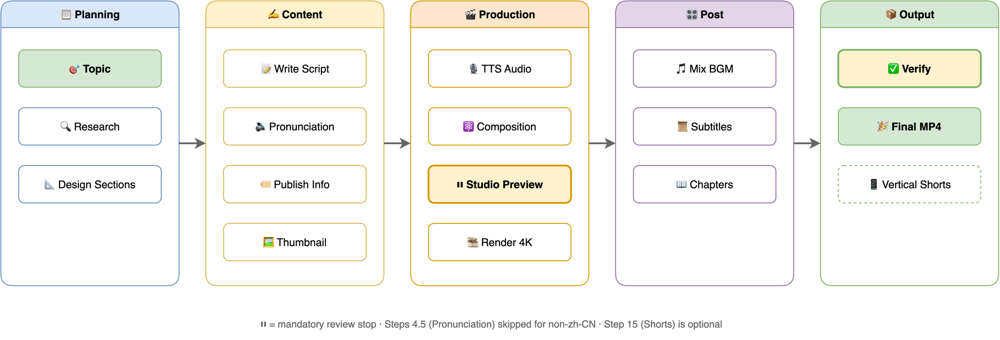
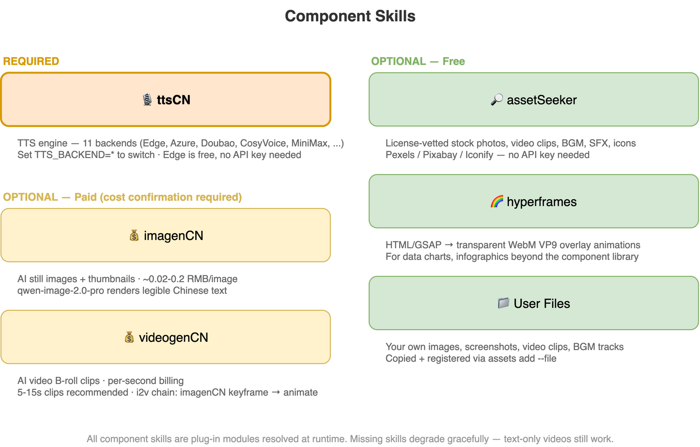
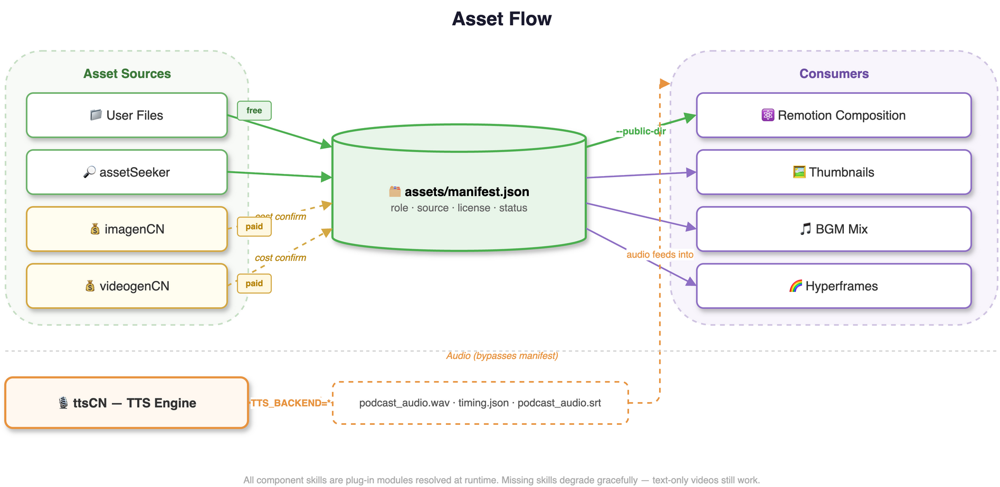

# Video Podcast Maker

[](LICENSE)
[](https://github.com/Agents365-ai/video-podcast-maker/stargazers)
[](https://github.com/Agents365-ai/video-podcast-maker/network/members)
[](https://github.com/Agents365-ai/video-podcast-maker/releases/latest)
[](https://github.com/Agents365-ai/video-podcast-maker/commits/main)

[](https://skillsmp.com)
[](https://github.com/Agents365-ai/365-skills)
[](https://agentskills.io)

[中文文档](README_CN.md)

Automated pipeline to create professional video podcasts from a topic. **Supports Bilibili, YouTube, Xiaohongshu, Douyin, and WeChat Channels** with multi-language output (zh-CN, en-US). Combines research, script generation, multi-engine TTS (11 backends incl. the ttsCN bridge), Remotion video rendering, and FFmpeg audio mixing.

**v4.0 "ttsCN Routing"**: all 11 TTS backends now synthesize through the required [ttsCN](https://github.com/Agents365-ai/ttsCN) component skill — one bridge adapter, per-platform expressiveness markers and phoneme handling, native word boundaries where the platform supports them.

**v3.0 "Asset Engine"**: a unified asset layer feeds the composition from five producers — your own files, [assetSeeker](https://github.com/Agents365-ai/assetSeeker) stock, [imagenCN](https://github.com/Agents365-ai/imagenCN) AI stills, [videogenCN](https://github.com/Agents365-ai/videogenCN) AI B-roll, and [Hyperframes](https://github.com/heygen-com/hyperframes) transparent overlays — all registered in a per-video manifest with license provenance. Free sources auto-resolve; paid generation always asks first. Every producer is optional: with none installed you still get a polished text-animation video.

**Works with:** [Claude Code](https://claude.ai/code) · [OpenClaw](https://openclaw.ai/) (ClawHub) · [OpenCode](https://opencode.ai/) · [Codex](https://openai.com/index/introducing-codex/) — any coding agent that supports SKILL.md

**Publish to:** Bilibili · YouTube · Xiaohongshu · Douyin · WeChat Channels

> **No coding required!** Just describe your topic in plain language — the coding agent guides you through each step interactively. You make creative decisions, the agent handles all the technical details. Creating your first video podcast is easier than you think.

> **Note:** This project is still under active development and may not be fully mature yet. We are continuously iterating and improving. Your feedback and suggestions are greatly appreciated — feel free to [open an issue](https://github.com/Agents365-ai/video-podcast-maker/issues) or reach out!

## Features

- **Topic Research** - Web search and content gathering
- **Script Writing** - Structured narration with section markers
- **Asset Engine (v3.0)** - Per-video `assets/manifest.json` registers every image/clip/overlay/audio asset with role, source, and license; consumed in Remotion via `AssetImage` / `AssetVideo` / `OverlayLayer`
- **Five Asset Producers** - User files, assetSeeker (license-vetted stock/BGM/SFX/icons), imagenCN (AI stills & thumbnails), videogenCN (AI B-roll with dry-run cost quotes), Hyperframes (transparent WebM VP9 overlay animations)
- **Cost Gates** - Paid AI generation never runs silently: quote → manifest `pending_confirmation` → explicit approval
- **Capability Probe** - `cli.py capabilities` reports which producers are installed and credentialed; everything degrades gracefully
- **Multi-TTS (11 platforms via ttsCN)** - Edge TTS (free), Azure Speech, CosyVoice, Volcengine Doubao, Tencent, Baidu, MiniMax, Xunfei, ElevenLabs, Google Cloud TTS, OpenAI TTS — all synthesized by the required [ttsCN](https://github.com/Agents365-ai/ttsCN) component skill; set `TTS_BACKEND` to any platform id directly
- **Remotion Video** - React-based video composition with animations
- **Visual Style Editing** - Adjust colors, fonts, and layout in Remotion Studio UI
- **Real-time Preview** - Remotion Studio for instant debugging before render
- **Auto Timing** - Audio-video sync via `timing.json`
- **BGM Mixing** - Background music overlay with FFmpeg
- **Remotion-native Subtitles** - SRT rendered inside Remotion at 4K with React/CSS; legacy FFmpeg burn-in remains available for special cases
- **4K Output** - 3840x2160 resolution for crisp uploads
- **Chapter Progress Bar** - Visual timeline showing current section during playback
- **Bilingual TTS** - Chinese/English mixed narration with Azure Speech or CosyVoice
- **Pronunciation Correction** - Global + per-project phoneme dictionaries for Chinese polyphone fixes
- **Bilibili Templates** - Ready-to-use Remotion templates (`Video.tsx`, `Root.tsx`, `Thumbnail.tsx`, `podcast.txt`) for quick project scaffolding
- **Component Library** - Reusable visual building blocks (ComparisonCard, Timeline, CodeBlock, QuoteBlock, FeatureGrid, DataBar, StatCounter, FlowChart, IconCard, DiagramReveal, AudioWaveform, LottieAnimation, MediaSection, SectionLayouts, AnimatedBackground) for composing rich section layouts
- **Manual Style Profiles** - User-managed `style_profiles` in `user_prefs.json` carry palette / typography / animation settings across videos (automatic preference learning is on the roadmap, not yet implemented)
- **Multi-Platform** - Bilibili, YouTube, Xiaohongshu, Douyin, and WeChat Channels with independent platform and language settings
- **Multi-Language** - Chinese (zh-CN) and English (en-US) script templates, TTS voices, subtitle fonts
- **Subtitle Preferences** - Custom font, size, color, outline; toggle subtitle burning on/off
- **Configurable CTA** - Auto (Bilibili triple/YouTube subscribe), animation, text, or custom

### Platform Optimizations

**Bilibili:**

- **Script Structure** - Welcome intro + call-to-action outro (一键三连)
- **Chapter Timestamps** - Auto-generated `MM:SS` format for B站 chapters
- **Thumbnail Generation** - AI (imagenCN) or Remotion, auto-generates 16:9 + 4:3 versions
- **Visual Style** - Bold text, minimal whitespace, high information density
- **Publish Info** - Title formulas, tag strategies, description templates

**YouTube:**

- **SEO Optimization** - Title <70 chars, keyword-rich description, tags and hashtags
- **Chapters** - Auto-generated YouTube chapter timestamps (first line at 0:00)
- **CTA** - "Like, Subscribe & Share" text animation or custom

**Xiaohongshu (小红书):**

- **Title** - Max 20 chars, punchy and emoji-friendly
- **Description** - 200-500 chars, 种草/knowledge-sharing style with emoji
- **Hashtags** - `#话题#` format (double hash), 5-10 tags
- **Thumbnail** - 3:4 (1080x1440) for feed optimization
- **CTA** - "点赞收藏加关注" text animation

**Douyin (抖音):**

- **Format** - Vertical shorts only (9:16), no horizontal long-form
- **Description** - 100-200 chars, casual and conversational with emoji
- **Hashtags** - `#话题` format (single hash), 3-8 tags
- **CTA** - "点赞关注" text only (no animation)

**WeChat Channels (微信视频号):**

- **Format** - Vertical shorts only (9:16), no horizontal long-form
- **Description** - 100-300 chars, knowledge-sharing style for forwarding
- **Hashtags** - `#话题` format (single hash), 3-8 tags
- **CTA** - "点赞关注，转发给朋友" text only (no animation)

## Workflow







## ⚠️ For the human reading this (not the AI): manually polish `podcast.txt`, repeatedly

> **This section is for you, the human — not the agent.** Every downstream step — TTS narration, subtitles, section transitions, animation timing, final cut — **is derived from this single `podcast.txt`**. A weak script renders into 4K garbage. No amount of polish downstream saves it.
>
> The AI-generated draft is a starting point, nothing more. Do these yourself — **don't hand them off to the AI**:
>
> 1. **Mentally read it as the narrator.** Treat each sentence as one breath — if a line forces you to "catch your breath" or backtrack to parse, fix it. Where you stumble silently is where TTS stumbles audibly.
> 2. **Revise at least three times.**
>    - Pass 1: typos, awkward phrasing, tongue-twisters
>    - Pass 2: cut filler, cut throat-clearing intros ("So today we're going to talk about…"), cut redundancy
>    - Pass 3: tune rhythm — where to pause, where to break a long sentence, which word carries the stress
> 3. **Read each `[SECTION:xxx]` block end-to-end.** Confirm each section opens with a hook and lands a clean transition into the next — not a bullet-point dump.
> 4. **Audit numbers, proper nouns, and English terms separately.** ~90% of TTS mispronunciations live here. If pronunciation is wrong, add it to `phonemes.json`; if it just sounds awkward, rewrite it.
> 5. **Know your length budget.** Estimate **~280 zh-CN chars/min** or **~150 en words/min**. A 5–10 min video means ~1400–2800 chars / 750–1500 words. Don't pad to fill time.
>
> **The only acceptance test:** read through it once in your head — does any line make you wince? If yes, don't move on to Step 8 (TTS) yet. Otherwise you're just rendering 4K of something even you don't want to hear.

## Related Skills

This skill depends on **remotion-best-practices** and works alongside other optional skills:

- **[remotion-best-practices](https://github.com/remotion-dev/skills)** - Official Remotion best practices (required, provides core Remotion patterns and guidelines — install from [remotion-dev/skills](https://github.com/remotion-dev/skills), docs at [remotion.dev/docs/ai/skills](https://www.remotion.dev/docs/ai/skills))
- **[assetSeeker](https://github.com/Agents365-ai/assetSeeker)** - License-vetted free stock photos/video/BGM/SFX/icons/fonts (optional asset producer)
- **[imagenCN](https://github.com/Agents365-ai/imagenCN)** - AI image generation for scene illustrations and thumbnails (optional, paid APIs)
- **[videogenCN](https://github.com/Agents365-ai/videogenCN)** - AI video clip generation for B-roll and i2v (optional, paid APIs)
- **[ttsCN](https://github.com/Agents365-ai/ttsCN)** - The TTS engine behind all 11 backends (**required** — install under `~/.claude/skills/ttsCN` or set `TTSCN_HOME`)
- **[Hyperframes](https://github.com/heygen-com/hyperframes)** - HTML→video renderer for transparent overlay animations (optional, Node 22+)
- **find-skills** - Official skill discovery tool (optional, helps find and install additional skills)
- **ffmpeg** - Advanced audio/video processing (optional)

## Requirements

### System Requirements

| Software | Version | Purpose |
| ---------- | --------- | --------- |
| **macOS / Linux** | - | Tested on macOS, Linux compatible |
| **Python** | 3.8+ | TTS script, automation |
| **Node.js** | 18+ | Remotion video rendering |
| **FFmpeg** | 4.0+ | Audio/video processing |

### Installation

```bash
# macOS
brew install ffmpeg node python3

# Ubuntu/Debian
sudo apt install ffmpeg nodejs python3 python3-pip

# Python dependencies — requirements.txt lives inside the skill bundle
# under skills/video-podcast-maker/. Run from the repo root:
pip install -r skills/video-podcast-maker/requirements.txt
```

> **Marketplace install (recommended):** users typically install this skill
> via the [365-skills marketplace](https://github.com/Agents365-ai/365-skills)
> rather than cloning. Then SKILL.md, scripts, and templates live under the
> plugin install path that the agent exposes as `${SKILL_DIR}` — paths in
> this README are written from the repo-root perspective for contributors.

### Project Setup (Required)

> **Important:** This skill requires a Remotion project as the foundation.

**Understanding the components:**

| Component | Source | Purpose |
|-----------|--------|---------|
| **Remotion Project** | `npx create-video` | Base framework with `src/`, `public/`, `package.json` |
| **video-podcast-maker** | SKILL.md workflow | Workflow orchestration (this skill) |

```bash
# Step 1: Create a new Remotion project (base framework)
npx create-video@latest my-video-project
cd my-video-project
npm i  # Install Remotion dependencies

# Step 2: Verify installation
npx remotion studio  # Should open browser preview
```

If you already have a Remotion project:

```bash
cd your-existing-project
npm install remotion @remotion/cli @remotion/player zod
```

### TTS Backends (all via ttsCN)

All 11 TTS platforms are synthesized by the **required** [ttsCN](https://github.com/Agents365-ai/ttsCN) component skill — install it under `~/.claude/skills/ttsCN` (or point `TTSCN_HOME` at its root). Set `TTS_BACKEND` to any platform id; only the active platform's env vars are needed:

| `TTS_BACKEND` | Provider | Required env vars | Get Key |
| --------------- | ---------- | ------------------- | --------- |
| `edge` (default) | Microsoft Edge TTS | *(none — free)* | — |
| `azure` | Microsoft Azure Speech | `AZURE_SPEECH_KEY` (+ `AZURE_SPEECH_REGION`) | [Azure Portal](https://portal.azure.com/) |
| `cosyvoice` | Aliyun CosyVoice | `DASHSCOPE_API_KEY` | [Aliyun Bailian](https://bailian.console.aliyun.com/) |
| `doubao` | Volcengine Doubao | `VOLCENGINE_APPID`, `VOLCENGINE_ACCESS_TOKEN` | [Volcengine Console](https://console.volcengine.com/speech/service/8) |
| `tencent` | Tencent Cloud TTS | `TENCENT_SECRET_ID`, `TENCENT_SECRET_KEY` | [Tencent Console](https://console.cloud.tencent.com/tts) |
| `baidu` | Baidu AI TTS | `BAIDU_APP_ID`, `BAIDU_API_KEY`, `BAIDU_SECRET_KEY` | [Baidu Console](https://console.bce.baidu.com/ai/#/ai/speech/overview) |
| `minimax` | MiniMax TTS | `MINIMAX_API_KEY` | [MiniMax Platform](https://platform.minimaxi.com/) |
| `xunfei` | iFlytek Xunfei TTS | `XUNFEI_APP_ID`, `XUNFEI_API_KEY`, `XUNFEI_API_SECRET` | [Xfyun](https://www.xfyun.cn/) |
| `elevenlabs` | ElevenLabs | `ELEVENLABS_API_KEY` | [ElevenLabs](https://elevenlabs.io/) |
| `openai` | OpenAI TTS | `OPENAI_API_KEY` | [OpenAI Platform](https://platform.openai.com/) |
| `google` | Google Cloud TTS | `GOOGLE_TTS_API_KEY` | [Google Cloud Console](https://console.cloud.google.com/) |

The legacy `TTS_BACKEND=ttscn` alias still works and picks its platform from `TTSCN_PLATFORM`.

### API Keys Required (non-TTS)

| Service | Purpose | Get Key |
|---------|---------|---------|
| **Google Gemini** | AI thumbnail generation (optional) | [AI Studio](https://aistudio.google.com/) |
| **Aliyun Dashscope** | AI thumbnail - Chinese optimized (optional) | [Aliyun Bailian](https://bailian.console.aliyun.com/) |

### Environment Variables

Add to `~/.zshrc` or `~/.bashrc`:

```bash
# TTS backend (see table above; all synthesis runs through the ttsCN component skill)
export TTS_BACKEND="edge"                            # or azure / cosyvoice / doubao / tencent / baidu / minimax / xunfei / elevenlabs / openai / google

# Optional: voice override (unset = ttsCN's per-platform default)
export TTS_VOICE="zh-CN-XiaoxiaoNeural"              # legacy per-backend vars (AZURE_TTS_VOICE, EDGE_TTS_VOICE, ...) still work

# Optional: speech rate and Azure express-as style
export TTS_RATE="+5%"                                # default +5%; also settable in user_prefs.json (global.tts.rate)
export TTS_STYLE="gentle"                            # azure only; "" disables the wrapper (global.tts.style)

# API keys for the active platform only, e.g. for azure:
export AZURE_SPEECH_KEY="your-azure-speech-key"
export AZURE_SPEECH_REGION="eastasia"

# Optional: Google Gemini for AI thumbnails
export GEMINI_API_KEY="your-gemini-api-key"

# Optional: Aliyun Dashscope for AI thumbnails (also the cosyvoice TTS key)
export DASHSCOPE_API_KEY="your-dashscope-api-key"
```

Then reload: `source ~/.zshrc`

## Quick Start

### Usage

This skill is designed for use with coding agents that support `SKILL.md`, including [Claude Code](https://claude.ai/claude-code), [Codex](https://openai.com/index/introducing-codex/), and [OpenCode](https://github.com/opencode-ai/opencode). Simply tell your agent:

> "Create a video podcast about [your topic]"

The agent will guide you through the entire workflow automatically.

> **Tips:** The quality of first-generation output heavily depends on the model's intelligence and capabilities — the smarter and more advanced the model, the better the results. In our testing, both Codex and Claude Code produce excellent videos on the first try, and OpenCode paired with GLM-5 also delivers solid results. If the initial output isn't perfect, you can preview it in Remotion Studio and ask the coding agent to keep refining until you're satisfied.

### Preview & Visual Editing with Remotion Studio

Before rendering the final video, use Remotion Studio to preview and visually edit styles:

```bash
npx remotion studio src/remotion/index.ts
```

This opens a browser-based editor where you can:

- **Visual Style Editing** - Adjust colors, fonts, and sizes in the right panel
- Scrub through the timeline frame-by-frame
- See live updates as you edit components
- Debug timing and animations instantly

#### Editable Properties

| Category | Properties |
| ---------- | ----------- |
| **Colors** | Primary color, background, text color, accent |
| **Typography** | Title size (72-120), subtitle size, body size |
| **Progress Bar** | Show/hide, height, font size, active color |
| **Audio** | BGM volume (0-0.3) |
| **Animation** | Enable/disable entrance animations |

## Configuration Files

All paths below are relative to the skill root (`skills/video-podcast-maker/` in this repo, or `${SKILL_DIR}` when installed via the marketplace):

| File | Scope | Purpose |
| ------ | ------- | --------- |
| `phonemes.json` | Global | Chinese polyphone dictionary shared across all projects. Auto-created from `phonemes.template.json` on first run. Edit to add/fix pronunciations (e.g., 行 háng vs xíng). Per-project overrides go in `videos/{name}/phonemes.json` |
| `user_prefs.template.json` | Global | Default preferences template. Copied to `user_prefs.json` on first run, which auto-evolves as the skill learns your style |
| `prefs_schema.json` | Global | JSON Schema for preference validation. Do not edit manually |
| `tsconfig.json` | Global | TypeScript config for Remotion templates |

## Output Structure

```
videos/{video-name}/
├── topic_definition.md      # Topic direction
├── topic_research.md        # Research notes
├── podcast.txt              # Narration script
├── phonemes.json            # (Optional) Project-specific pronunciation overrides
├── podcast_audio.wav        # TTS audio
├── podcast_audio.srt        # Subtitles
├── timing.json              # Section timing for sync
├── thumbnail_*.png          # Video thumbnails
├── publish_info.md          # Title, tags, description
├── part_*.wav               # TTS segments (temp, cleanup via Step 14)
├── output.mp4               # Raw render (temp)
├── video_with_bgm.mp4       # With BGM (temp)
└── final_video.mp4          # Final output
```

## Background Music

Included tracks in `skills/video-podcast-maker/assets/`:

- `perfect-beauty-191271.mp3` - Upbeat, positive
- `snow-stevekaldes-piano-397491.mp3` - Calm piano

## Roadmap

- [x] Vertical video support (9:16) for immersive mobile playback
- [x] Remotion transitions (@remotion/transitions) for professional chapter cuts
- [x] Component template library (ComparisonCard, Timeline, CodeBlock, QuoteBlock, FeatureGrid, DataBar, StatCounter, FlowChart, IconCard)
- [x] Broadcast-grade visual upgrade (gradient backgrounds, layered shadows, animated counters, quality checklist)
- [x] Multi-engine TTS (11 platforms via the ttsCN component: Edge, Azure, CosyVoice, Doubao, Tencent, Baidu, MiniMax, Xunfei, ElevenLabs, OpenAI, Google Cloud)
- [x] Free Edge TTS backend (no API key required)
- [x] Multi-platform publishing (Bilibili + YouTube) with independent language settings (zh-CN, en-US)
- [x] Resumable synthesis (`--resume`)
- [x] Estimation mode (`--dry-run` duration estimate without API calls)
- [ ] Self-evolving user preferences (automatic visual/TTS/content style learning) — planned; preferences are currently user-managed
- [ ] Visual QA — automated aesthetic/layout review of rendered sections — planned, not yet implemented
- [x] Skill docs restructured as a `SKILL.md` workflow usable by Claude Code, Codex, OpenCode, and OpenClaw
- [x] Design learning system — learn visual styles from reference videos/images into a reusable profile library
- [ ] Playwright auto-capture — analyze Bilibili/YouTube video design straight from a URL (Phase 4)
- [ ] Step 9 smart recommendations — auto-match saved style profiles when making a video (Phase 5)
- [ ] Thumbnail design learning — apply learned cover styles to the Thumbnail.tsx template (Phase 5)
- [ ] Automated YouTube publishing — upload video, metadata, chapters, and thumbnail via the YouTube Data API
- [ ] Windows support (WSL validation + docs)

## ❤️ Support

If this project helps you, consider supporting the author:

<table>
  <tr>
    <td align="center">
      
      <br>
      <b>WeChat Pay</b>
    </td>
    <td align="center">
      
      <br>
      <b>Alipay</b>
    </td>
    <td align="center">
      
      <br>
      <b>Buy Me a Coffee</b>
    </td>
    <td align="center">
      
      <br>
      <b>Give a Reward</b>
    </td>
  </tr>
</table>

## 👤 Author

**Agents365-ai**

- Bilibili: <https://space.bilibili.com/441831884>
- GitHub: <https://github.com/Agents365-ai>

## 📄 License

[CC BY-NC 4.0](LICENSE) — Free for non-commercial use. Commercial use requires permission.
