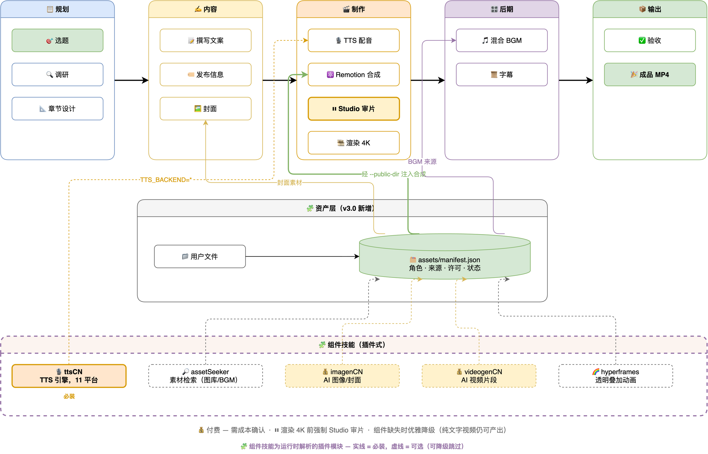

# 视频播客生成器

[](LICENSE)
[](https://github.com/Agents365-ai/video-podcast-maker/stargazers)
[](https://github.com/Agents365-ai/video-podcast-maker/network/members)
[](https://github.com/Agents365-ai/video-podcast-maker/releases/latest)
[](https://github.com/Agents365-ai/video-podcast-maker/commits/main)

[](https://skillsmp.com)
[](https://github.com/Agents365-ai/365-skills)
[](https://agentskills.io)

[English](README.md)

自动化流程，从主题生成专业视频播客。**支持 B站 (Bilibili)、YouTube、小红书、抖音和微信视频号**，多语言输出（zh-CN、en-US）。集成研究、脚本撰写、多引擎 TTS（11 个后端，含 ttsCN 桥接）、Remotion 视频渲染和 FFmpeg 音频混音。

**v4.0「ttsCN 路由」**：全部 11 个 TTS 后端统一经必装的 [ttsCN](https://github.com/Agents365-ai/ttsCN) 组件技能合成——单一桥接适配器，按平台处理表现力标记与多音字，支持原生字级时间戳的平台自动启用。

**v3.0「资产引擎」**：统一的资产层从五种生产者向合成供货——你自己的文件、[assetSeeker](https://github.com/Agents365-ai/assetSeeker) 免费图库、[imagenCN](https://github.com/Agents365-ai/imagenCN) AI 图片、[videogenCN](https://github.com/Agents365-ai/videogenCN) AI 视频片段、[Hyperframes](https://github.com/heygen-com/hyperframes) 透明动画叠层——全部登记进每视频的 manifest 并记录许可来源。免费资源自动解析，付费生成必先确认。所有生产者均为可选：一个不装也能产出精良的纯文字动画视频。

**支持工具：** [Claude Code](https://claude.ai/code) · [OpenClaw](https://openclaw.ai/) (ClawHub) · [OpenCode](https://opencode.ai/) · [Codex](https://openai.com/index/introducing-codex/) — 任何支持 SKILL.md 的 coding agent

**发布平台：** B站 · YouTube · 小红书 · 抖音 · 微信视频号

> **无需编程！** 用自然语言描述你的主题，coding agent 会一步步引导你完成。你做创意决策，agent 处理所有技术细节。制作你的第一个视频播客，比你想象的更简单。

> **提示：** 本项目仍在持续迭代完善中，部分功能可能还不太成熟。欢迎提出宝贵意见和建议 — 可以 [提交 Issue](https://github.com/Agents365-ai/video-podcast-maker/issues) 或直接联系作者！

## 功能特点

- **主题研究** - 网络搜索与内容收集
- **脚本撰写** - 带章节标记的结构化旁白
- **资产引擎（v3.0）** - 每视频的 `assets/manifest.json` 登记全部图片/视频/叠层/音频资产（角色、来源、许可），Remotion 侧通过 `AssetImage` / `AssetVideo` / `OverlayLayer` 消费
- **五种资产生产者** - 用户文件、assetSeeker（许可核验的图库/BGM/音效/图标）、imagenCN（AI 图片与封面）、videogenCN（AI B-roll，dry-run 报价）、Hyperframes（透明 WebM VP9 动画叠层）
- **成本确认门** - 付费 AI 生成绝不静默执行：报价 → manifest `pending_confirmation` → 明确批准
- **能力探测** - `cli.py capabilities` 报告各生产者的安装与密钥状态；全链路优雅降级
- **多 TTS 引擎（11 个平台，经 ttsCN 合成）** - Edge TTS（免费）、Azure Speech、CosyVoice、火山引擎豆包、腾讯云、百度、MiniMax、讯飞、ElevenLabs、Google Cloud TTS、OpenAI TTS —— 全部由必装的 [ttsCN](https://github.com/Agents365-ai/ttsCN) 组件技能合成，`TTS_BACKEND` 可直接填任意平台 id
- **Remotion 视频** - 基于 React 的视频合成与动画
- **可视化样式编辑** - 在 Remotion Studio 界面调整颜色、字体、布局
- **实时预览** - Remotion Studio 即时调试，渲染前预览效果
- **自动同步** - 通过 `timing.json` 实现音视频同步
- **背景音乐** - FFmpeg 叠加背景音乐
- **Remotion 原生字幕** - SRT 在 Remotion 内以 React/CSS 直接 4K 渲染（默认）；传统 FFmpeg 烧录仍可用于特殊场景
- **4K 输出** - 3840x2160 分辨率，画质清晰
- **章节进度条** - 可视化时间轴，实时显示当前章节
- **中英混读** - Azure Speech 或 CosyVoice 支持中英文混合旁白
- **发音校正** - 全局 + 项目级多音字词典，精准控制中文发音
- **B站模板** - 开箱即用的 Remotion 模板（`Video.tsx`、`Root.tsx`、`Thumbnail.tsx`、`podcast.txt`），快速搭建项目
- **手动风格档案** - 用户在 `user_prefs.json` 的 `style_profiles` 中维护配色/字体/动画设置，跨视频复用（自动偏好学习在路线图上，尚未实现）
- **多平台支持** - B站 (Bilibili)、YouTube、小红书、抖音和微信视频号，独立配置平台和语言
- **多语言支持** - 中文 (zh-CN) 和英文 (en-US) 脚本模板、TTS 音色、字幕字体
- **字幕偏好** - 自定义字体、字号、颜色、描边，支持开关字幕烧录
- **CTA 可配置** - 自动（B站三连/YouTube订阅）、动画、文字、自定义

### 平台优化

**B站:**

- **脚本结构** - 欢迎开场 + 一键三连片尾引导
- **章节时间戳** - 自动生成 `MM:SS` 格式，直接复制到B站
- **封面生成** - AI (imagenCN) 或 Remotion，自动生成 16:9 + 4:3 双版本
- **视觉风格** - 大字饱满、极少留白、信息密度高
- **发布信息** - 标题公式、标签策略、简介模板

**YouTube:**

- **SEO 优化** - 标题 <70 字符、关键词描述、标签和 hashtags
- **Chapters** - 自动生成 YouTube 章节时间戳（首行 0:00）
- **CTA** - "Like, Subscribe & Share" 文字动画或自定义

**小红书:**

- **标题** - 不超过 20 字，简洁有力，可用 emoji
- **正文** - 200-500 字，种草/知识分享风格，支持 emoji
- **话题标签** - `#话题#` 格式（双井号），5-10 个
- **封面** - 3:4（1080x1440）适配信息流
- **CTA** - "点赞收藏加关注" 文字动画

**抖音:**

- **格式** - 仅竖屏精华片段（9:16），不生成横屏长视频
- **文案** - 100-200 字，口语化风格，支持 emoji
- **话题标签** - `#话题` 格式（单井号），3-8 个
- **CTA** - "点赞关注" 纯文字（无动画）

**微信视频号:**

- **格式** - 仅竖屏精华片段（9:16），不生成横屏长视频
- **文案** - 100-300 字，知识分享风格，适合转发
- **话题标签** - `#话题` 格式（单井号），3-8 个
- **CTA** - "点赞关注，转发给朋友" 纯文字（无动画）

## 工作流程



## ⚠️ 给读到这里的你（不是给 AI 看的）：`podcast.txt` 必须人工反复打磨

> **这一节是写给你这个真人的，不是写给 agent 的。** 整条流水线后面所有环节 — TTS 朗读、字幕、章节切换、动画节奏、最终成片 — **全部由这一份 `podcast.txt` 决定**。脚本不行，4K 渲出来的也是垃圾。
>
> AI 生成的初稿只是起点。请你亲自做下面这些事，**不要交给 AI 代劳**：
>
> 1. **按口播节奏在脑子里默读。** 每句话当成一口气说完 — 哪句让你"换气换不过来"、哪句要回头重读才懂，立刻改。读得舒服 ≠ 听得舒服，TTS 卡住的地方往往就是你默读时也卡的地方。
> 2. **至少改三遍。**
>    - 第一遍：抓错别字、明显语病、绕口处
>    - 第二遍：砍废话、砍套话、砍"那么我们今天就来聊一聊"这种开场
>    - 第三遍：调节奏 — 哪里断句、哪里加停顿、长句切短、重音落在哪个词上
> 3. **逐章节通读。** 每个 `[SECTION:xxx]` 块从头看到尾，确认开头有钩子、结尾能自然过渡到下一节，不是一堆并列要点堆在一起。
> 4. **数字 / 专有名词 / 英文术语单独审一遍。** TTS 念错的 90% 都集中在这里。读音不对的，去 `phonemes.json` 加词条；读着别扭的，直接换说法。
> 5. **心里要有时长账。** 中文按 **每分钟约 280 字** 估算（英文约每分钟 150 词）。目标 5-10 分钟 ≈ 1400-2800 字，不要凑。
>
> **校验通过的唯一标准：脑子里走完一遍，没有任何一句让你皱眉。** 达不到就不要进 Step 8（TTS），否则你只是在用 4K 渲染一段连你自己都不想听完的内容。

## 相关技能

本技能依赖 **remotion-best-practices**，并可与其他可选技能配合使用：

- **[remotion-best-practices](https://github.com/remotion-dev/skills)** - Remotion 官方最佳实践（必需，提供核心 Remotion 模式与规范——从 [remotion-dev/skills](https://github.com/remotion-dev/skills) 安装，文档见 [remotion.dev/docs/ai/skills](https://www.remotion.dev/docs/ai/skills)）
- **[assetSeeker](https://github.com/Agents365-ai/assetSeeker)** - 许可核验的免费图库/视频/BGM/音效/图标/字体（可选资产生产者）
- **[imagenCN](https://github.com/Agents365-ai/imagenCN)** - AI 图片生成，用于场景插图与封面（可选，付费 API）
- **[videogenCN](https://github.com/Agents365-ai/videogenCN)** - AI 视频片段生成，用于 B-roll 与图生视频（可选，付费 API）
- **[ttsCN](https://github.com/Agents365-ai/ttsCN)** - 全部 11 个 TTS 后端的合成引擎（**必需** —— 安装到 `~/.claude/skills/ttsCN` 或设置 `TTSCN_HOME`）
- **[Hyperframes](https://github.com/heygen-com/hyperframes)** - HTML→视频渲染器，产出透明动画叠层（可选，Node 22+）
- **find-skills** - 官方技能发现工具（可选，用于查找和安装更多技能）
- **ffmpeg** - 高级音视频处理（可选）

## 环境要求

### 系统要求

| 软件 | 版本 | 用途 |
| ------ | ------ | ------ |
| **macOS / Linux** | - | 已在 macOS 测试，兼容 Linux |
| **Python** | 3.8+ | TTS 脚本、自动化 |
| **Node.js** | 18+ | Remotion 视频渲染 |
| **FFmpeg** | 4.0+ | 音视频处理 |

### 安装依赖

```bash
# macOS
brew install ffmpeg node python3

# Ubuntu/Debian
sudo apt install ffmpeg nodejs python3 python3-pip

# Python 依赖（requirements.txt 位于技能包内）
pip install -r skills/video-podcast-maker/requirements.txt
```

> **推荐通过 marketplace 安装：** 一般用户应通过 [365-skills marketplace](https://github.com/Agents365-ai/365-skills) 安装本技能，而非克隆本仓库。届时 SKILL.md / scripts / templates 会位于 agent 暴露的 `${SKILL_DIR}` 路径下；README 中的路径写法是面向贡献者（仓库根目录视角）。

### 项目初始化（必需）

> **重要：** 本技能需要一个 Remotion 项目作为基础。

**组件关系说明：**

| 组件 | 来源 | 作用 |
|------|------|------|
| **Remotion 项目** | `npx create-video` | 基础框架，包含 `src/`、`public/`、`package.json` |
| **video-podcast-maker** | SKILL.md 工作流 | 工作流编排（本技能） |

```bash
# 第一步：创建 Remotion 项目（基础框架）
npx create-video@latest my-video-project
cd my-video-project
npm i  # 安装 Remotion 依赖

# 第二步：验证安装
npx remotion studio  # 应打开浏览器预览
```

如果你已有 Remotion 项目：

```bash
cd your-existing-project
npm install remotion @remotion/cli @remotion/player zod
```

### TTS 后端（全部经 ttsCN 合成）

全部 11 个 TTS 平台均由**必装**的 [ttsCN](https://github.com/Agents365-ai/ttsCN) 组件技能负责合成 —— 请将其安装到 `~/.claude/skills/ttsCN`（或用 `TTSCN_HOME` 指向其根目录）。`TTS_BACKEND` 直接填平台 id，只需配置当前平台的环境变量：

| `TTS_BACKEND` | 平台 | 所需环境变量 | 获取密钥 |
| --------------- | ------ | ------------- | --------- |
| `edge`（默认） | 微软 Edge TTS | *（无 —— 免费）* | — |
| `azure` | 微软 Azure Speech | `AZURE_SPEECH_KEY`（+ `AZURE_SPEECH_REGION`） | [Azure 门户](https://portal.azure.com/) |
| `cosyvoice` | 阿里云 CosyVoice | `DASHSCOPE_API_KEY` | [百炼控制台](https://bailian.console.aliyun.com/) |
| `doubao` | 火山引擎豆包 | `VOLCENGINE_APPID`、`VOLCENGINE_ACCESS_TOKEN` | [火山引擎控制台](https://console.volcengine.com/speech/service/8) |
| `tencent` | 腾讯云 TTS | `TENCENT_SECRET_ID`、`TENCENT_SECRET_KEY` | [腾讯云控制台](https://console.cloud.tencent.com/tts) |
| `baidu` | 百度 AI TTS | `BAIDU_APP_ID`、`BAIDU_API_KEY`、`BAIDU_SECRET_KEY` | [百度控制台](https://console.bce.baidu.com/ai/#/ai/speech/overview) |
| `minimax` | MiniMax TTS | `MINIMAX_API_KEY` | [MiniMax 平台](https://platform.minimaxi.com/) |
| `xunfei` | 科大讯飞 TTS | `XUNFEI_APP_ID`、`XUNFEI_API_KEY`、`XUNFEI_API_SECRET` | [讯飞开放平台](https://www.xfyun.cn/) |
| `elevenlabs` | ElevenLabs | `ELEVENLABS_API_KEY` | [ElevenLabs](https://elevenlabs.io/) |
| `openai` | OpenAI TTS | `OPENAI_API_KEY` | [OpenAI Platform](https://platform.openai.com/) |
| `google` | Google Cloud TTS | `GOOGLE_TTS_API_KEY` | [Google Cloud 控制台](https://console.cloud.google.com/) |

旧的 `TTS_BACKEND=ttscn` 别名仍然可用，其平台由 `TTSCN_PLATFORM` 指定。

### 所需 API 密钥（非 TTS）

| 服务 | 用途 | 获取方式 |
| ------ | ------ | --------- |
| **Google Gemini** | AI 封面生成（可选） | [AI Studio](https://aistudio.google.com/) |
| **阿里云百炼** | AI 封面生成 - 中文优化（可选） | [百炼控制台](https://bailian.console.aliyun.com/) |

### 环境变量

添加到 `~/.zshrc` 或 `~/.bashrc`：

```bash
# TTS 后端（见上表；所有合成均经 ttsCN 组件技能完成）
export TTS_BACKEND="edge"                            # 或 azure / cosyvoice / doubao / tencent / baidu / minimax / xunfei / elevenlabs / openai / google

# 可选：音色覆盖（不设置则使用 ttsCN 的平台默认音色）
export TTS_VOICE="zh-CN-XiaoxiaoNeural"              # 旧的按后端变量（AZURE_TTS_VOICE、EDGE_TTS_VOICE 等）仍然有效

# 可选：语速与 Azure express-as 风格
export TTS_RATE="+5%"                                # 默认 +5%；也可写入 user_prefs.json（global.tts.rate）
export TTS_STYLE="gentle"                            # 仅 azure 生效；"" 关闭 express-as 包装（global.tts.style）

# 仅需当前平台的 API 密钥，例如 azure：
export AZURE_SPEECH_KEY="your-azure-speech-key"
export AZURE_SPEECH_REGION="eastasia"

# 可选：Google Gemini 生成 AI 封面
export GEMINI_API_KEY="your-gemini-api-key"

# 可选：阿里云百炼生成 AI 封面（同时也是 cosyvoice 的 TTS 密钥）
export DASHSCOPE_API_KEY="your-dashscope-api-key"
```

然后重新加载：`source ~/.zshrc`

## 快速开始

### 使用方法

本技能适用于支持 `SKILL.md` 的 coding agent，包括 [Claude Code](https://claude.ai/claude-code)、[Codex](https://openai.com/index/introducing-codex/) 和 [OpenCode](https://github.com/opencode-ai/opencode)。只需告诉你的 agent：

> "帮我制作一个关于 [你的主题] 的视频播客"

agent 会自动引导你完成整个流程。

> **提示：** 经过多次测试，初次生成的效果和模型效果有很大的关系，模型越智能越先进，生成的效果会越好。目前初次生成 Codex 和 Claude Code 生成的视频效果都不错，OpenCode 搭配 GLM-5 也还不错。如果第一次生成的不够好，可以在 Remotion Studio 预览，并让 coding agent 继续修改。

### 预览与可视化编辑

在渲染最终视频前，使用 Remotion Studio 实时预览和可视化编辑样式：

```bash
npx remotion studio src/remotion/index.ts
```

这会打开一个浏览器编辑器，你可以：

- **可视化样式编辑** - 在右侧面板调整颜色、字体、尺寸
- 逐帧拖动时间轴查看效果
- 编辑组件时实时看到更新
- 即时调试时间和动画

#### 可编辑属性

| 分类 | 属性 |
| ------ | ------ |
| **颜色** | 主色调、背景色、文字颜色、强调色 |
| **字体** | 标题大小 (72-120)、副标题、正文 |
| **进度条** | 显示/隐藏、高度、字号、激活颜色 |
| **音频** | BGM 音量 (0-0.3) |
| **动画** | 启用/禁用入场动画 |

## 配置文件

下表所有路径都相对于技能根目录（本仓库为 `skills/video-podcast-maker/`，通过 marketplace 安装后为 `${SKILL_DIR}`）：

| 文件 | 作用域 | 说明 |
| ------ | -------- | ------ |
| `phonemes.json` | 全局 | 多音字词典，所有视频项目共享。首次运行时由脚本从 `phonemes.template.json` 自动复制。可直接编辑添加/修正发音（如 行 háng vs xíng）。项目级覆盖放在 `videos/{名称}/phonemes.json` |
| `user_prefs.template.json` | 全局 | 偏好默认模板。首次运行时自动复制为 `user_prefs.json`，后续随使用自动学习你的风格 |
| `prefs_schema.json` | 全局 | 偏好验证的 JSON Schema，无需手动编辑 |
| `tsconfig.json` | 全局 | Remotion 模板的 TypeScript 配置 |

## 输出结构

```
videos/{视频名称}/
├── topic_definition.md      # 主题定义
├── topic_research.md        # 研究笔记
├── podcast.txt              # 旁白脚本
├── phonemes.json            # （可选）项目专属发音覆盖
├── podcast_audio.wav        # TTS 音频
├── podcast_audio.srt        # 字幕文件
├── timing.json              # 章节时间轴
├── thumbnail_*.png          # 视频封面
├── publish_info.md          # 标题、标签、简介
├── part_*.wav               # TTS 分段（临时，Step 14 清理）
├── output.mp4               # 原始渲染（临时）
├── video_with_bgm.mp4       # 含背景音乐（临时）
└── final_video.mp4          # 最终输出
```

## 背景音乐

`skills/video-podcast-maker/assets/` 目录下包含：

- `perfect-beauty-191271.mp3` - 轻快积极
- `snow-stevekaldes-piano-397491.mp3` - 舒缓钢琴

## 开发路线

- [x] 支持竖屏视频 (9:16)，适配 B站手机端沉浸式播放
- [x] Remotion 转场效果 (@remotion/transitions)，章节间过渡更专业
- [x] 组件模板库 (ComparisonCard, Timeline, CodeBlock, QuoteBlock, FeatureGrid, DataBar, StatCounter, FlowChart, IconCard)
- [x] 广播级画质升级（渐变背景、多层阴影、动画计数器、质量检查清单）
- [x] 多 TTS 引擎支持（11 个平台，经 ttsCN 组件合成：Edge、Azure、CosyVoice、豆包、腾讯云、百度、MiniMax、讯飞、ElevenLabs、OpenAI、Google Cloud）
- [x] Edge TTS 免费后端（无需 API 密钥）
- [x] 多平台支持（B站 + YouTube），独立语言配置（zh-CN、en-US）
- [x] 断点续传（`--resume` 参数）
- [x] 预估模式（`--dry-run` 预估时长，不调用 API）
- [ ] 用户偏好自我进化（自动学习视觉/TTS/内容风格偏好）——规划中，当前偏好为手动管理
- [ ] 视觉检查 - 对生成后的页面进行视觉检查，检查其美观性、布局合理性等——规划中，尚未实现
- [x] 将技能文档重构为可被 Claude Code、Codex、OpenCode、OpenClaw 共同使用的 `SKILL.md` 工作流
- [x] 设计学习系统 — 从参考视频/图片中学习设计风格，构建设计参考库和可复用的风格档案
- [ ] Playwright 自动抓取 — 通过 URL 直接分析 B站/YouTube 视频设计风格（Phase 4）
- [ ] Step 9 智能推荐 — 制作视频时自动匹配并推荐已有风格档案（Phase 5）
- [ ] 封面设计学习 — 将学到的封面风格应用到 Thumbnail.tsx 模板（Phase 5）
- [ ] YouTube 自动化发布 — 通过 YouTube Data API 上传视频、元数据、章节、封面
- [ ] Windows 适配 (WSL 验证 + 文档)

## ❤️ 支持作者

如果这个项目对你有帮助，欢迎支持作者：

<table>
  <tr>
    <td align="center">
      
      <br>
      <b>微信支付</b>
    </td>
    <td align="center">
      
      <br>
      <b>支付宝</b>
    </td>
    <td align="center">
      
      <br>
      <b>Buy Me a Coffee</b>
    </td>
    <td align="center">
      
      <br>
      <b>打赏</b>
    </td>
  </tr>
</table>

## 💬 支持

如有问题、功能建议或疑问，请在 [GitHub 提交 Issue](https://github.com/Agents365-ai/video-podcast-maker/issues)。

## 👤 作者

**Agents365-ai**

- B站: <https://space.bilibili.com/441831884>
- GitHub: <https://github.com/Agents365-ai>

## 📄 开源协议

[CC BY-NC 4.0](LICENSE) — 非商业使用免费，商业使用需授权。
